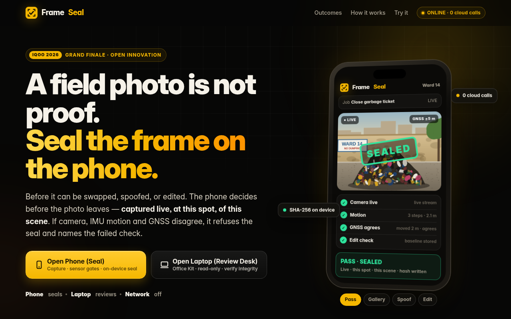
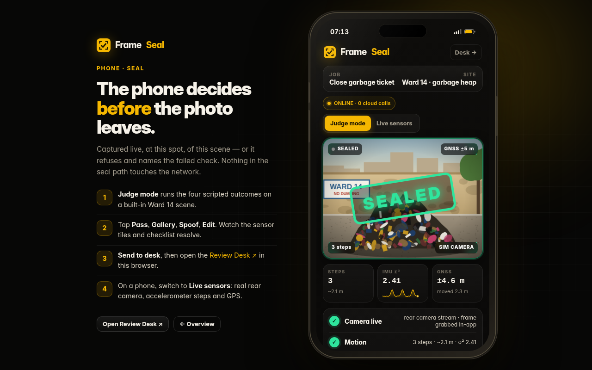
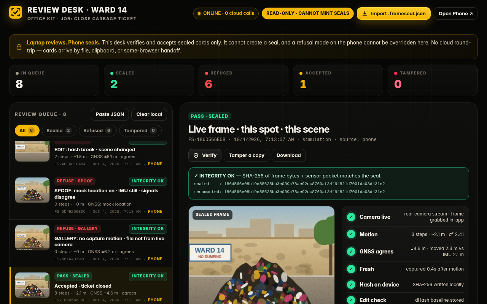
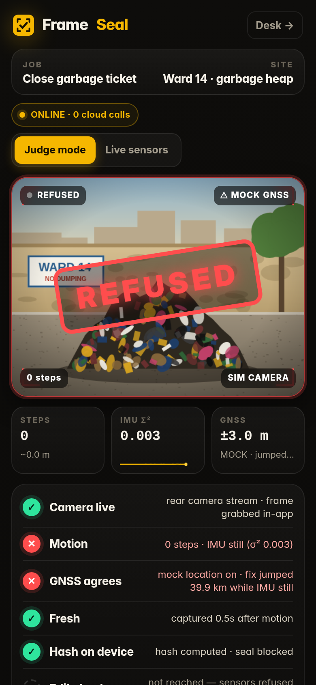
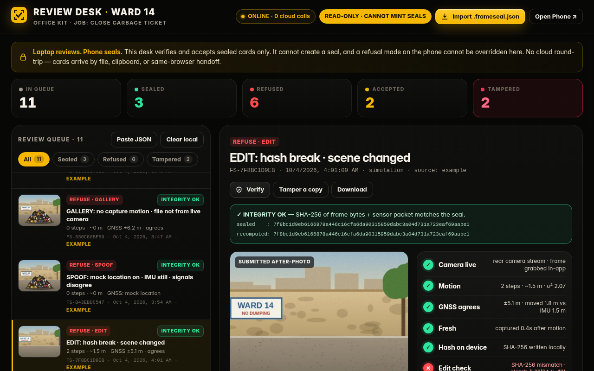
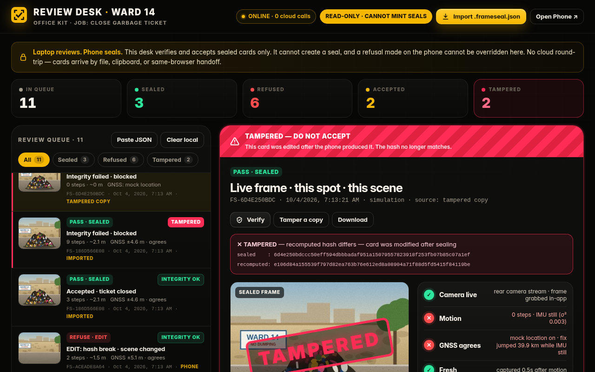
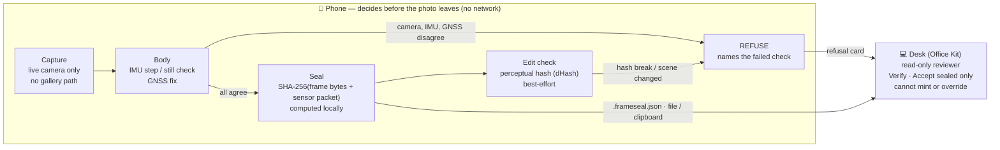

<div align="center">


# FrameSeal

### A field photo is not proof. Seal the frame on the phone before it can be swapped, spoofed, or edited.

**Phone seals. Laptop reviews. Network off.**

**▶ Live prototype: [aneek22112007-tech.github.io/frameseal](https://aneek22112007-tech.github.io/frameseal/)** · [Phone (Seal)](https://aneek22112007-tech.github.io/frameseal/phone.html) · [Laptop (Review Desk)](https://aneek22112007-tech.github.io/frameseal/desk.html)


</div>

<p align="center"></p>

<p align="center">
  
  
</p>

---

## The problem

The person who signs off on a field photo — to **pay a wage, close a ward ticket, or release a delivery** — has nothing but a JPEG and trust. Photos get re-used from the gallery, GPS gets spoofed, and generative tools can wipe the very thing the photo was supposed to prove.

| Evidence | Source (as cited in our deck) |
|---|---|
| Latehar NMMS review: **6,595 of 6,709** worksite photos found fraudulent or duplicated — **75** had already been approved. | Times of India, Sep 2026 |
| Gurugram: one worker **AI-wiped a garbage heap** from a photo; another **spoofed GPS from Jhajjar**. | The Print, Jul 2026 |
| Fake delivery attempts are a named driver of India's **25–40% e-commerce RTO**. | Seller logistics reports, 2026 |

## Who it's for

**The reviewer, not the worker.** The ward officer closing a garbage ticket, the supervisor releasing a wage, the seller deciding whether a "delivery attempted" photo is real. FrameSeal gives them a card that says *how* the frame was captured — and it refuses on the phone when the phone's own sensors disagree.

**Demo site (one site only):** Ward 14 · garbage heap · job **“Close garbage ticket”**.

## The phone decides before the photo leaves

Captured **live**, at **this spot**, of **this scene**. If camera, IMU motion and GNSS disagree, the phone **refuses the seal and names the failed check**. The laptop (Office Kit review desk) can review but **cannot mint a seal**, and refusals **cannot be overridden** there.

| Outcome | What happened | What the reviewer sees |
|---|---|---|
| ✅ **PASS · SEALED** | Walked ~2 steps, live frame, GNSS agrees, hash written | Accept & close ticket |
| ⛔ **REFUSE · GALLERY** | No capture motion, file is old, seal blocked | `GALLERY: no capture motion · file not from live camera` |
| ⛔ **REFUSE · SPOOF** | Mock location on, IMU still, signals disagree | `SPOOF: mock location on · IMU still · signals disagree` |
| ⛔ **REFUSE · EDIT** | After-photo wiped, hash mismatch, scene changed | `EDIT: hash break · scene changed` |

## Try it in 30 seconds (judge mode)

1. Open **[Phone (Seal)](https://aneek22112007-tech.github.io/frameseal/phone.html)**. On a laptop it opens in **Judge mode** inside a phone frame, with a procedurally drawn Ward 14 scene.
2. Tap **Pass**, **Gallery**, **Spoof**, **Edit**. Sensor tiles tick (steps, IMU variance, GNSS), the checklist resolves, and a **SEALED** or **REFUSED** stamp names the failed check. The SHA-256, dHash and seal card are computed for real on your device.
3. Tap **Send to desk** (or **Download** the `.frameseal.json`, or **Copy JSON**).
4. Open **[Laptop (Review Desk)](https://aneek22112007-tech.github.io/frameseal/desk.html)** in the same browser. Four example cards are preloaded; your cards appear on top. **Accept** the sealed card; refused cards show *“Blocked — refusal cannot be overridden on the laptop.”*
5. Press **Verify** (recomputes SHA-256 over frame + packet), then **Tamper a copy** — the desk flips a refusal to “SEALED” in the JSON (or nudges the GNSS fix) and immediately flags it **TAMPERED**. Dropping a hand-edited `.frameseal.json` on the desk does the same.
6. After a PASS, tap **Tamper test: AI-wipe the heap** to watch the edit check break the hash.

**Real-sensor mode (on a phone, over HTTPS — GitHub Pages works):** open the phone page, it defaults to **Live sensors**. Tap **Start live capture** (grants camera, motion — iOS asks explicitly — and location), **walk ~2 steps toward the subject**, tap **Seal frame** within 20 s. Hold the phone still or deny GPS and it refuses, naming the check. **Try gallery upload** always refuses. Once loaded, the app is cached by a service worker, so you can switch on **airplane mode** and keep sealing — the header chip flips to **NETWORK OFF**.

<p align="center">
  
  
</p>
<p align="center"></p>

## Architecture



**Rules:** sensors refuse first · the model/hash only checks the edit · **no cloud call in the seal path**.

### The seal card

Every outcome — sealed or refused — produces a `frameseal.card/v1` JSON:

```jsonc
{
  "schema": "frameseal.card/v1",
  "id": "FS-3F9A…",                    // first 10 hex of sha256
  "job": "Close garbage ticket",
  "site": "Ward 14 · garbage heap",
  "timestamp": "2026-10-04T03:40:00.000Z",
  "verdict": "SEALED | REFUSED",
  "outcome": "PASS | GALLERY | SPOOF | EDIT | …",
  "failed_check": "SPOOF: mock location on · IMU still · signals disagree",
  "checks": [{ "id": "camera_live", "pass": true, "detail": "…" }, …],
  "sha256": "…",                       // see hash_spec
  "dhash": "317363b3e3f1d8b8",         // 64-bit perceptual hash
  "packet": { "capture": {…}, "imu": {…}, "gnss": {…}, "agreement": {…}, "device": {…} },
  "hash_spec": "sha256( frame_jpeg_bytes || utf8( canonical_json( card minus {id, sha256, frame, thumbnail, hash_spec} ) ) )",
  "thumbnail": "data:image/jpeg;base64,…",
  "frame": "data:image/jpeg;base64,…"  // the exact bytes that were hashed
}
```

Because the verdict, checks and sensor packet are inside the hash, editing *any* of them (e.g. flipping `REFUSED` → `SEALED`) is caught by the desk's **Verify**.

## What is AI and what is not

| Part | How it works | AI? |
|---|---|---|
| Live-capture gate | Frame must come from the in-app camera stream; gallery files are refused | No — rule |
| Motion gate | Accelerometer magnitude → low-pass → hysteresis peak detector → steps (≥ 2, ~1.5 m); variance < 0.02 ⇒ "IMU still" | No — signal processing |
| GNSS agreement | GNSS jump > 25 m (beyond reported accuracy) or speed > 8 m/s while IMU is still ⇒ SPOOF; GNSS frozen while walking ⇒ SPOOF | No — sensor fusion rule |
| Seal | SHA-256 via WebCrypto over frame bytes + canonical sensor packet | No — cryptography |
| Edit check | SHA-256 compare + 64-bit dHash Hamming distance (> 10/64 ⇒ scene changed) | Classical perceptual hashing. A learned edit/inpaint detector is a roadmap add-on, and **never** claims to catch every deepfake |

Sensors refuse first; the hash/model layer only judges the *edit*.

## From web prototype to the production Android build

This repo is a browser prototype so judges can try it instantly. The production target is a native Android app — mapping:

| Prototype (web) | Production (Android) |
|---|---|
| `getUserMedia` rear camera, frame grabbed to canvas | **CameraX / Camera2** live capture inside `CaptureActivity`; **no gallery intent** exists in the app |
| `DeviceMotionEvent` + JS step detector | **SensorManager** `TYPE_STEP_DETECTOR` + `TYPE_LINEAR_ACCELERATION` (`MotionGate`) |
| `navigator.geolocation.watchPosition` | **FusedLocationProvider** + **GNSS raw measurements**, and `Location.isMock()` / `isFromMockProvider()` — the web cannot see mock providers, Android can (`GnssGate`) |
| WebCrypto SHA-256 | SHA-256 signed by a hardware-backed **Android Keystore** key (StrongBox where available); **Play Integrity** attestation on the roadmap (`Sealer`) |
| `.frameseal.json` download / clipboard / same-browser localStorage | **Office Kit** handoff by file share or clipboard to the laptop desk — still no cloud round-trip (`DeskExport`) |
| Service worker offline cache | App works fully in airplane mode by design |

A sketch of the module layout is in [`android/`](android/README.md) — clearly labelled as the production plan, not a finished app.

## Honest limitations

- **The edit check is best-effort.** dHash catches big scene changes (like a wiped heap) and any byte change breaks SHA-256, but it is not a deepfake detector and we don't claim it is.
- **Re-photographing a screen is a known attack.** A live capture of a monitor showing an old photo can pass motion + GNSS. Roadmap: screen / moiré detection and an autofocus-depth cue.
- **The web can't see mock-location providers.** In live web mode SPOOF is inferred only from GNSS-vs-IMU disagreement; the Android build adds `isMock()` and raw GNSS checks. Judge mode demonstrates the full SPOOF path.
- **Browser hashes are unsigned.** Anyone can compute a SHA-256; the prototype proves integrity, not origin. Origin comes from the Android Keystore signature (roadmap above).
- Step detection is a simple peak detector; phones vary. Thresholds are tuned for a hand-held walk.
- The prototype seals a 480×360 JPEG so cards stay small enough for local storage; production seals the full-resolution capture.
- Judge mode replays scripted sensor traces on a procedurally drawn scene (no real photos are used or shipped).

## 48-hour scope

- **IN:** Ward-heap close (one site, one job) · four outcome cards · offline on-device seal · read-only review desk with integrity verify.
- **OUT:** multi-suite (wages, deliveries and other job types), accounts/backends, Keystore signing in the web build.

## Run locally

No build step, no dependencies, no CDNs, no analytics. The UI font (Inter, SIL OFL — see `assets/fonts/LICENSE-Inter.txt`) is self-hosted and Latin-subset, so the whole app stays offline-capable.

```bash
git clone https://github.com/aneek22112007-tech/frameseal && cd frameseal
python3 -m http.server 8000   # then open http://localhost:8000
```

Live sensors need a secure context (HTTPS or `localhost`) and a phone with camera, motion sensors and GPS.

```
index.html      landing page
phone.html      seal app (judge mode + live sensors)
desk.html       Office Kit review desk (read-only)
assets/core.js  SHA-256, dHash, scene, seal card, verify — shared
assets/phone.js capture, motion/GNSS gates, scenarios
assets/desk.js  queue, filters, counters, import, verify, accept/blocked
assets/landing.js hero phone loop, scroll reveal, count-up stats
sw.js           offline cache (airplane mode)
android/        production module sketch (plan only)
```

## Team

_Team name / members — to be added._ Built for the **iQOO Hackathon 2026 Grand Finale · Open Innovation** track.
